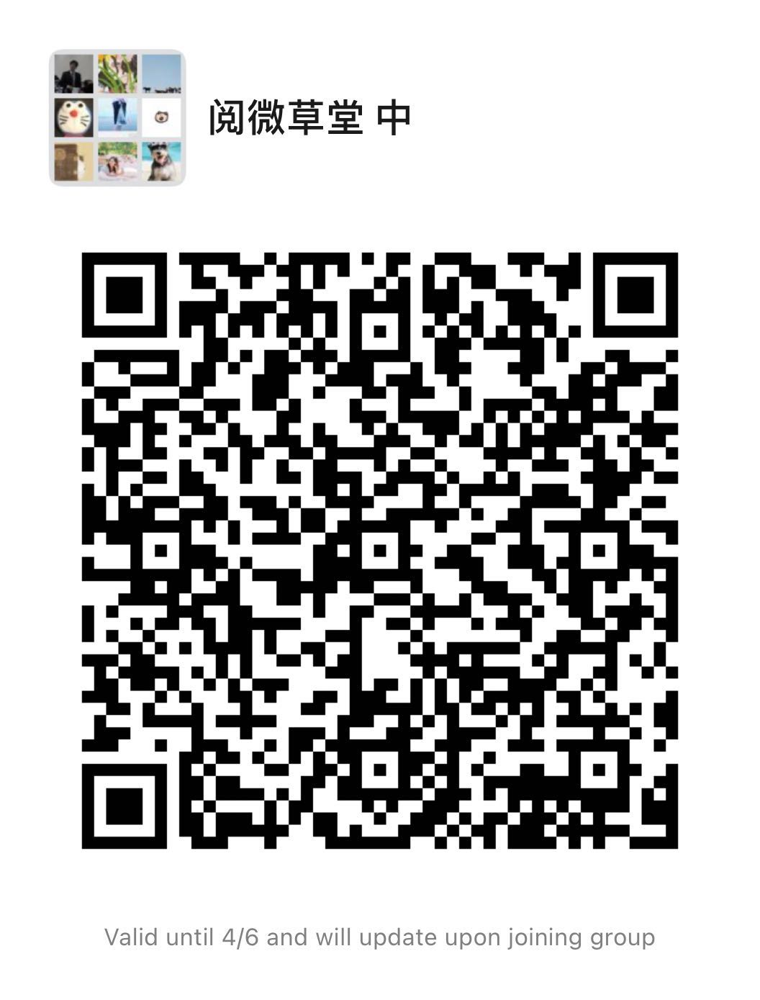

# notes
## clubhouse历届文档整理

- ### 2021-03-31
  1. [3-31读万泉县主墓志.pdf](mettings/2021-03-31/3-31读万泉县主墓志.pdf)

- ### 2021-03-30
  1. [3-30夜读许浑诗单.pdf](mettings/2021-03-30/3-30夜读许浑诗单.pdf)

- ### 2021-03-29
  1. [3-29夜读陈子昂诗单.pdf](mettings/2021-03-29/3-29夜读陈子昂诗单.pdf)

- ### 2021-03-28
  1. [3-28夜读周邦彦诗单.pdf](mettings/2021-03-28/3-28夜读周邦彦诗单.pdf)
 
- ### 2021-03-27
  > 引用文献：[温庭筠全集校注.下册.刘学锴校注](./references/温庭筠全集校注.下册.刘学锴校注.pdf)
  1. [27日夜读温庭筠.pdf](mettings/2021-03-27/3-27读温庭筠诗单.pdf)
   

- ### 2021-03-26
  1. 读李商隐，照《全唐诗》从《人欲》开始读
- ### 2021-03-23
  1. [23日夜读席慕容.pdf](mettings/2021-03-23/23日夜读席慕容.pdf)

- ### 2021-03-22
  1. [22日夜读杜牧.pdf](mettings/2021-03-22/3-22夜读杜牧诗.pdf)

- ### 2021-03-21
  1. [21日夜续读周邦彦.pdf](mettings/2021-03-21/3-21日夜续读周邦彦.pdf)

- ### 2021-03-20
  1. [20日夜读春日詩.pdf](mettings/2021-03-20/3月20日春日詩.pdf)
   
- ### 2021-03-19
  1. [19日夜读庾肩吾.pdf](mettings/2021-03-19/3-19日夜读庾肩吾.pdf)

- ### 2021-03-17
  1. [17日夜读杜牧.pdf](mettings/2021-03-17/杜牧.pdf)

- ### 2021-03-16
  1. [16日夜读庾信第二场.pdf](mettings/2021-03-16/16日夜。庾信第二场。.pdf)
  2. [庾信的记忆宫殿.pdf](mettings/2021-03-16/庾信的记忆宫殿.pdf)

- ### 2021-03-15
  1. [3月15日夜读庾信.pdf](mettings/2021-03-15/3月15日夜读庾信.pdf)

- ### 2021-03-13
  1. [3-13夜读周邦彦.pdf](mettings/2021-03-13/3:13夜读周邦彦.pdf)

## 参考文献

1. [魏晋南北朝时期的中国东部温度变化_郑景云.pdf](references/魏晋南北朝时期的中国东部温度变化_郑景云.pdf)

2. [何以黄河在东汉以后会出现一个长期安流的局面_谭其服.pdf](references/何以黄河在东汉以后会出现一个长期安流的局面_谭其服.pdf)
   
3. [暗恐_非家幻觉_童明.pdf](./references/暗恐_非家幻觉_童明.pdf)
   
4. [秋水堂论金瓶梅.pdf](./references/秋水堂论金瓶梅.pdf)
   
5. [新诗诗人目录（年代索引）.pdf](./references/新诗诗人目录(年代索引).pdf)

6. [《杜牧集系年校注》](./references/杜牧集系年校注_全四册/index.md)  

    6.1 [杜牧集系年校注-第1册](./references/杜牧集系年校注_全四册/杜牧集系年校注-第1册.pdf)  
  
    6.2 [杜牧集系年校注-第2册](./references/杜牧集系年校注_全四册/杜牧集系年校注-第2册.pdf)  

    6.3 [杜牧集系年校注-第3册](./references/杜牧集系年校注_全四册/杜牧集系年校注-第3册.pdf)  

    6.4 [杜牧集系年校注-第4册](./references/杜牧集系年校注_全四册/杜牧集系年校注-第4册.pdf)  
  
7. [中国古典文学基本丛书.清真集.宋周邦彦撰.吴则虞校点.中华书局.1981](./references/中国古典文学基本丛书.清真集.宋周邦彦撰.吴则虞校点.中华书局.1981.pdf)

8. [温庭筠全集校注.下册.刘学锴校注](./references/温庭筠全集校注.下册.刘学锴校注.pdf)

## 音频
1. [春夜别友人.mp3](./assets/audio/春夜别友人.mp3)

## 声明
所有文献均整理自`clubhouse`【中国的中古】频道微信群内文档。

**文献均来自互联网，著作权归原作者所有。** 请不要将其使用于商业场景，仅用私下交流探讨所用，十分感谢您对于文学的热爱和对知识产权的保护。

[clubhose频道](https://www.joinclubhouse.com/club/%E4%B8%AD%E5%9C%8B%E7%9A%84%E4%B8%AD%E5%8F%A4)

微信群

