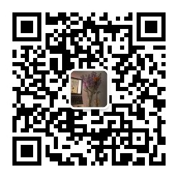

## 会议记录
- ### 2021年4月
  + [23日 夜读帖中诗诗单](meetings/2021-04/4-23夜读帖中诗.pdf)
  
  + [22日 夜读皇帝诗诗单](meetings/2021-04/4-22夜读皇帝诗更新.pdf)

  + [21日 夜读左思诗单](meetings/2021-04/4-21夜读左思.pdf)

  + [20日 再读陈子昂。感遇诗单](meetings/2021-04/4-19再读陈子昂。感遇.pdf)
    > 引用文献：[《陈子昂集》（修订本） [唐]陈子昂著.徐鹏标校 P2-P13](references/《陈子昂集》(修订本)[唐]陈子昂著.徐鹏标校。2013年11月第1版(原中华书局1960年版).pdf)

  + [19日 再读陈子昂。感遇诗单](meetings/2021-04/4-19再读陈子昂。感遇.pdf)
    > 引用文献：[《陈子昂集》（修订本） [唐]陈子昂著.徐鹏标校 P2-P13](references/《陈子昂集》(修订本)[唐]陈子昂著.徐鹏标校。2013年11月第1版(原中华书局1960年版).pdf)

  + [18日 夜读古诗十九首诗单](meetings/2021-04/4-17。18夜读古诗十九首.pdf)

  + [17日 夜读古诗十九首诗单](meetings/2021-04/4-17。18夜读古诗十九首.pdf)

  + [16日 夜读三曹诗单](meetings/2021-04/4-16夜读三曹.pdf)
    > 引用文献：[《魏晋南北朝史札记》 周一良](references/4-16_魏晋南北朝史札记_周一良.pdf)

  + [15日 夜读謝靈運诗单](meetings/2021-04/4-15夜读謝靈運.pdf)

  + [14日 上巳夜读诗单](meetings/2021-04/4-14上巳夜读.pdf)
  
  + [13日 夜读二陸诗单](meetings/2021-04/4-13二陸.pdf)
  
  + [12日 复读王維诗单](meetings/2021-04/4-12复读王維.pdf)
  
  + [11日 夜读木心诗单](meetings/2021-04/4-11木心.pdf)
    > 引用文献： [木心回忆录后记](references/木心回忆录后记.pdf)

  + [10日 夜读姜夔诗单](meetings/2021-04/4-10姜夔.pdf)
  
  + [9日 夜读屈原。怀沙篇](meetings/2021-04/4-9屈原怀沙篇.pdf)
  
  + [8日 夜读韦应物诗单](meetings/2021-04/4-8韦应物.pdf)

  + [7日 夜读边塞诗](meetings/2021-04/4-7边塞诗.pdf)

  + [6日 夜读贾岛诗单](meetings/2021-04/4-6贾岛.pdf)

  + [5日 夜读王维诗单](meetings/2021-04/4-5王维.pdf)

  + [4日 夜读周邦彦诗单](meetings/2021-04/4-4周邦彦.pdf)

---

- ### 2021年3月
  + [31日 夜读万泉县主墓志](meetings/2021-03/3-31夜读万泉县主墓志.pdf)
  
  + [30日 夜读许浑诗单](meetings/2021-03/3-30夜读许浑诗单.pdf)
  
  + [29日 夜读陈子昂诗单](meetings/2021-03/3-29夜读陈子昂诗单.pdf)
  
  + [28日 夜读周邦彦诗单第二场](meetings/2021-03/3-28夜读周邦彦诗单.pdf)

  + [27日 夜读温庭筠诗单](meetings/2021-03/3-27夜读温庭筠诗单.pdf)
    > 引用文献： [温庭筠全集校注.下册.刘学锴校注](references/温庭筠全集校注.下册.刘学锴校注.pdf)

  + [23日 夜读席慕容](meetings/2021-03/3-23夜读席慕容.pdf)

  + [22日 夜读杜牧诗诗单](meetings/2021-03/3-22夜读杜牧诗.pdf)

  + [20日 夜读春日詩](meetings/2021-03/3-20夜读春日詩.pdf)

  + [19日 夜读庾肩吾](meetings/2021-03/3-19夜读庾肩吾.pdf)

  + [17日 夜读杜牧](meetings/2021-03/3-17夜读杜牧.pdf)
  
  + [16日 夜读庾信第二场](meetings/2021-03/3-16日夜读庾信第二场.pdf)

  + [15日 夜读庾信](meetings/2021-03/3-15夜读庾信.pdf)

  + [13日 夜读周邦彦](meetings/2021-03/3-13夜读周邦彦.pdf)

## 参考文献

1. [魏晋南北朝时期的中国东部温度变化_郑景云.pdf](references/魏晋南北朝时期的中国东部温度变化_郑景云.pdf)

2. [何以黄河在东汉以后会出现一个长期安流的局面_谭其服.pdf](references/何以黄河在东汉以后会出现一个长期安流的局面_谭其服.pdf)
   
3. [暗恐_非家幻觉_童明.pdf](./references/暗恐_非家幻觉_童明.pdf)
   
4. [秋水堂论金瓶梅.pdf](./references/秋水堂论金瓶梅.pdf)
   
5. [新诗诗人目录（年代索引）.pdf](./references/新诗诗人目录(年代索引).pdf)

6. [《杜牧集系年校注》](./references/杜牧集系年校注_全四册/index.md)  

    6.1 [杜牧集系年校注-第1册](./references/杜牧集系年校注_全四册/杜牧集系年校注-第1册.pdf)  
  
    6.2 [杜牧集系年校注-第2册](./references/杜牧集系年校注_全四册/杜牧集系年校注-第2册.pdf)  

    6.3 [杜牧集系年校注-第3册](./references/杜牧集系年校注_全四册/杜牧集系年校注-第3册.pdf)  

    6.4 [杜牧集系年校注-第4册](./references/杜牧集系年校注_全四册/杜牧集系年校注-第4册.pdf)  
  
7. [《中国古典文学基本丛书.清真集》 [宋]周邦彦撰.吴则虞校点.中华书局.1981](./references/中国古典文学基本丛书.清真集.宋周邦彦撰.吴则虞校点.中华书局.1981.pdf)

8. [《温庭筠全集校注.下册》 刘学锴校注](./references/温庭筠全集校注.下册.刘学锴校注.pdf)

9. [《木心回忆录》后记.陈丹青](.references/木心回忆录后记.pdf)

10. [庾信《园庭》等七诗作年考](references/庾信《园庭》等七诗作年考.pdf)

11. [庾信的记忆宫殿](references/庾信的记忆宫殿.pdf)

12. [《陈子昂集》（修订本）[唐]陈子昂著.徐鹏标校。2013年11月第1版（原中华书局1960年版）](references/《陈子昂集》(修订本)[唐]陈子昂著.徐鹏标校。2013年11月第1版(原中华书局1960年版).pdf)

13. [《魏晋南北朝史札记》 周一良](references/4-16_魏晋南北朝史札记_周一良.pdf)

## 音频
1. [春夜别友人.mp3](./assets/audio/春夜别友人.mp3)

## 声明
所有文献均整理自`clubhouse`【中国的中古】频道微信群内文档。

**文献均来自互联网，著作权归原作者所有。** 请不要将其使用于商业场景，仅用私下交流探讨所用，十分感谢您对于文学的热爱和对知识产权的保护。

[clubhose频道](https://www.joinclubhouse.com/club/%E4%B8%AD%E5%9C%8B%E7%9A%84%E4%B8%AD%E5%8F%A4)

公众号

Instagram Medieval-China

